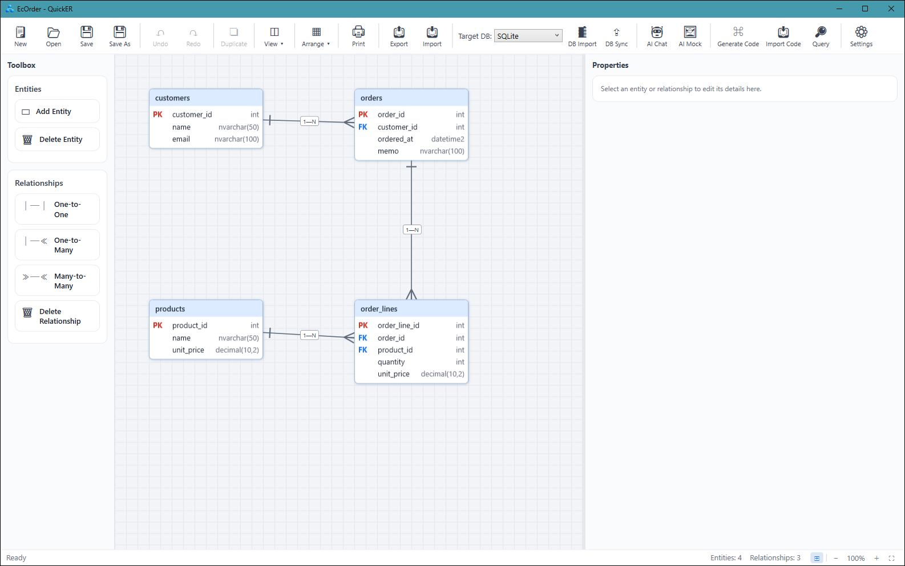

# QuickER

*日本語 | [English](README.md)*

*ライセンス: [MIT](LICENSE)（コア）＋ [PolyForm NC](LICENSE-NC.md)（AI 機能・コード生成系 — 現在は商用利用を含め全員無料）。詳細は[ライセンス](#ライセンス)節を参照。*

**AI 支援のビジュアル ER 設計 × マルチ DB 往復（取込・同期・DDL）× C# コード生成（Repository / EF Core）を一気通貫でつなぐ、Windows 用 ER 図デザイナ。**

ER 図を描く → データベースを作る → C# のデータアクセスコードを生成して動かす、までを 1 つのツールで往復できます。既存 DB からの取込・差分同期にも対応し、AI チャットで図の生成・編集もできます。



## 特徴

- **ビジュアル ER 設計** — crow's foot 記法、1対1 / 1対多 / 多対多、複合主キー、FK 参照アクション（Cascade / SetNull / NoAction）、包括的な Undo/Redo。ズーム・パン・エンティティ検索（Ctrl+F）・ミニマップ・関連ハイライト・複数選択＋一括操作・簡易表示（PK/FK のみ）で大規模図にも対応
- **マルチ DB** — SQL Server / PostgreSQL / MySQL / Oracle / SQLite の 5 方言で、スキーマ取込・差分同期・DDL 生成をサポート。図ごとにターゲット DB を保持し、いつでも方言を切り替え可能（型は自動変換、変換不能な型は警告表示・Undo 可）
- **C# コード生成** — Entity / EditModel / Mapper に加え、DB アクセス層を選んで生成:
  - **Repository (QuickER)** — 依存最小の軽量 Repository（式木クエリ・Include・グラフ保存・楽観排他・生 SQL の逃げ道付き）
  - **EF Core** — 既存 Entity をそのまま載せる DbContext ＋ 同一インターフェイスの EF 実装。**DI 登録 1 行の差し替え**で Repository (QuickER) と交換可能
  - **名前付きクエリ** — 検索メソッドの定義（条件・並び順・ページング・射影）を図に保存し、型付きの Repository メソッド（例 `GetByCustomerAsync(int customerId, ...)`）として全実装（Repository (QuickER) / EF Core）へ自動生成。条件はミニ DSL（`CustomerId = @customerId AND Memo LIKE @keyword` 等）で書き、GUI エディタが即時検証
  - **リモート対応インターフェイス（--remote-contracts）** — CRUD・保存・名前付きクエリ（＝将来 Web サービス越しに提供できる操作）だけを持つ `I{Entity}RemoteRepository` を追加生成するオプション。`I{Entity}Repository` は全メソッドを持ったままこれを継承するため既存コードに影響はなく、アプリ本体をリモート面だけに依存させておけば、将来のリモート実装への差し替えがコンパイル時に安全になる
- **AI チャット** — 対話で ER 図を生成・編集（OpenAI / Anthropic の API キー、Ollama、Codex、Claude Code に対応）。ER 図から Web モック画面（HTML）の生成も可能
- **豊富な入出力** — 取込: DBML / Mermaid / Excel 定義書 / 実 DB（5 方言）。出力: PNG / SVG / SQL DDL / Mermaid / DBML / Excel 定義書 / ベクタ印刷（1 ページ縮小・原寸大 PDF）
- **git フレンドリーな保存形式** — 意味モデル（テーブル定義）と視覚情報（座標・色）を分離した JSON 1 ファイル
- **CLI（dotnet tool）** — GUI なしでコード生成。`quicker generate`（ER 図 JSON → コード）/ `quicker scaffold`（DB 直結 → コード）

## 対応 DBMS

| DBMS | スキーマ取込 | 差分同期 | DDL 生成 | 方言切替（型変換） | 備考 |
|---|:-:|:-:|:-:|:-:|---|
| SQL Server | ✅ | ✅ | ✅ | ✅ | 説明は拡張プロパティ（MS_Description）と同期 |
| PostgreSQL | ✅ | ✅ | ✅ | ✅ | 13 以降 |
| MySQL | ✅ | ✅ | ✅ | ✅ | 8.0 以降（MariaDB は対象外） |
| Oracle | ✅ | ✅ | ✅ | ✅ | 19c 以降 |
| SQLite | ✅ | ✅ | ✅ | ✅ | ファイル DB。サンプルはこれを使用 |

実 DB を使う取込・同期は、実 DB 統合テスト（SQL Server / PostgreSQL / MySQL / Oracle は Testcontainers の実コンテナ、SQLite は実ファイル DB）で往復を継続的に検証しています。

## クイックスタート — 動くサンプル（外部 DB 不要）

リポジトリには「設計 → 保存 → 生成 → ビルド → 実行」を一往復した完成品のサンプル（[samples/ec-order](samples/ec-order)）が入っています。SQLite ファイル DB を使うため、**.NET 10 SDK さえあれば clone 直後にそのまま動きます**。

```powershell
git clone https://github.com/QuickER/QuickER.git
cd QuickER
dotnet run --project samples/ec-order/EcOrderSample
```

```text
[準備] EcOrder.sql の DDL で SQLite ファイル DB（ec-order.db）を作成しました。

[1] 顧客 2 件・商品 2 件を登録しました。

[2] 注文 1 件＋注文明細 2 行をグラフ保存しました（保存レコード数: 3）。

[3] Where 式木＋Include で注文を取得しました:
    注文ID=1000 顧客ID=1 備考=初回注文
    明細ID=5000 商品=コーヒー豆 200g 数量=2 単価=980
    明細ID=5001 商品=マグカップ 数量=1 単価=1500
...
すべてのシナリオが成功しました。
```

サンプルの中身:

- [EcOrder.json](samples/ec-order/EcOrder.json) — GUI で開ける ER 図（上のスクリーンショットの図そのもの）
- [EcOrder.sql](samples/ec-order/EcOrder.sql) — 図から生成した SQLite DDL
- [EcOrder.g.cs](samples/ec-order/EcOrderSample/Generated/EcOrder.g.cs) — 図から生成した C# コード（Entity / EditModel / Mapper / Repository）
- [Program.cs](samples/ec-order/EcOrderSample/Program.cs) — 生成コードで CRUD・グラフ保存・Include・生 SQL 集計・削除カスケードを実演

### 自分で一往復する

1. **設計** — GUI でサンプル図（`samples/ec-order/EcOrder.json`）を開いて編集し、保存する（例: `products` に列を追加）
2. **生成** — CLI でコードと入れ替える:

   ```powershell
   dotnet run --project src/QuickER.Cli -- generate `
     --schema samples/ec-order/EcOrder.json `
     --out samples/ec-order/EcOrderSample/Generated `
     --provider sqlite `
     --config samples/ec-order/quicker.json
   ```

3. **DDL** — GUI の「出力」から DDL をエクスポートして `EcOrder.sql` を更新する
4. **実行** — `dotnet run --project samples/ec-order/EcOrderSample` で動かす

詳細は [samples/ec-order/README.ja.md](samples/ec-order/README.ja.md) を参照してください。

## インストール / 入手

### GUI（QuickER 本体）

- **GitHub Releases** — zip をダウンロードして展開し、`QuickER.exe` を実行します。フレームワーク依存のため、[.NET 10 Desktop Runtime と ASP.NET Core Runtime](https://dotnet.microsoft.com/download/dotnet/10.0) のインストールが必要です
- **ソースから** — `.NET 10 SDK` があれば次で起動できます:

  ```powershell
  dotnet run --project src/QuickER.Gui
  ```

### CLI（quicker コマンド）

NuGet 公開後は dotnet tool としてインストールできます:

```powershell
dotnet tool install --global QuickER.Cli
quicker generate --schema diagram.json --out ./Generated --provider sqlserver
```

未公開の間はソースから実行してください（`dotnet run --project src/QuickER.Cli -- generate ...`）。

### ランタイムパッケージ（オプション）

生成コードは既定で自己完結（ランタイム込みのインライン出力）です。固定コードを NuGet パッケージ参照に切り替える `--runtime-packages` モードでは、`QuickER.Runtime` / `QuickER.Runtime.SqlServer` / `QuickER.Runtime.Sqlite` / `QuickER.Runtime.EntityFrameworkCore` を参照します。詳細は [docs/code-generation.md](docs/code-generation.md) を参照してください。

## DB アクセス生成の選び方

生成ダイアログ（GUI）ではデータアクセス層を 3 択から選びます:

| 選択肢 | 対象 DB | 特徴・向いている場面 |
|---|---|---|
| **なし**（既定） | — | Entity / EditModel / Mapper のみ。データアクセスは自前で書く |
| **Repository (QuickER)** | SQL Server / SQLite | 依存最小（ADO のみ）の軽量 Repository。式木クエリ・`Include`/`ThenInclude`・グラフ保存・bulk・楽観排他（SQL Server rowversion）・生 SQL 実行を装備。射影・GroupBy・Join は式木未対応（生 SQL か EF Core で回避） |
| **EF Core** | 5 方言 | 方言非依存の `QuickErDbContext` ＋ 同一 Repository インターフェイスの EF 実装。マイグレーションは範囲外（スキーマは DDL 生成の責務）で、既存スキーマへの接続専用 |

Repository (QuickER) と EF Core は**同じインターフェイス**を実装するため、DI 登録 1 行の差し替えで交換できます:

```csharp
// Repository (QuickER・自作 SQLite 実装)
services.AddGeneratedRepositories(connectionString);

// EF Core 実装（同じ ICustomerRepository などが解決される）
services.AddGeneratedEfCoreRepositories(options => options.UseSqlite(connectionString));
```

SQL Server と SQLite へ同時対応するマルチターゲット生成（keyed DI）もあります。詳細は [docs/code-generation.md](docs/code-generation.md) を参照してください。

## AI チャット

ツールバーの「AI チャット」から、対話で ER 図を生成・編集できます（「EC サイトの注文管理のテーブルを設計して」など）。接続方式は次から選べます:

- **API キー** — OpenAI / Anthropic (Claude)。Ollama はローカル実行のためキー不要
- **Codex / Claude Code** — 各 CLI のアカウント認証を利用

設定方法は [docs/ai-chat.md](docs/ai-chat.md) を参照してください。

## 開発

Windows ＋ .NET 10 SDK が必要です（GUI・テストが WPF に依存するため、ビルド・テストは Windows のみ）。

```powershell
dotnet build QuickER.slnx        # ビルド
dotnet test QuickER.slnx         # 全テスト（Docker があれば実 DB 統合テストも実行、無ければ自動スキップ）
```

## ドキュメント

- [CLI リファレンス（generate / scaffold・quicker.json）](docs/cli.md)
- [生成コードの使い方（Repository API・EF Core・ランタイムパッケージ）](docs/code-generation.md)
- [AI チャットの設定](docs/ai-chat.md)
- [動くサンプル（EC 注文ドメイン）](samples/ec-order/README.ja.md)

## サポート・貢献

個人開発のため、サポートは**ベストエフォート**（対応期限の約束なし）・対象は**最新版のみ**です。バグ報告・機能要望は Issue へどうぞ（日本語・英語どちらでも歓迎）。Pull Request は事前に Issue での相談をお願いします — 詳細は [CONTRIBUTING.md](CONTRIBUTING.md)、脆弱性の報告は [SECURITY.md](SECURITY.md) を参照してください。

変更履歴は [CHANGELOG.md](CHANGELOG.md) にあります。

## ライセンス

QuickER が**生成したコード（インライン出力されるランタイム部分を含む）はあなたの成果物**であり、ライセンスによる制限なく自由に利用・改変・配布できます。

本リポジトリ自体は、プロジェクトごとに 2 種類のライセンスを使い分けています：

| 対象 | ライセンス |
|---|---|
| コア（ER 図エディタ・入出力・DDL 生成・スキーマ取込/差分同期・ランタイムパッケージ 4 種 など） | [MIT License](LICENSE) — 永続無料 |
| AI 機能群・コード生成系（`QuickER.AI` / `AI.UI` / `AI.Chat` / `AI.Mock` / `CodeGen.CSharp` / `CodeGen.UI` / `Cli` の 7 プロジェクト） | [PolyForm Noncommercial 1.0.0](LICENSE-NC.md) — 下記の提供方針を参照 |

### AI 機能・コード生成の提供方針（将来の有償化に関する予告）

- **現在はすべての機能を、商用利用を含め全員が無料で利用できます**
- 将来、**AI 機能と DB アクセスコード生成（Repository (QuickER) / EF Core / マルチターゲット）について、商用利用のみ有償ライセンス化する可能性があります**
- その場合も、次を約束します：
  - **個人・非商用利用は永続無料**
  - **基本のコード生成（Entity / EditModel / Mapper）は商用利用を含め永続無料**
  - **有償化する場合は事前に告知し、既存利用者には移行期間を設けます**
- PolyForm NC 部分のソースコードは、非商用目的での利用・改変・再配布が引き続き可能です

上記の約束は [LICENSE-NC.md](LICENSE-NC.md) の「Additional Grants（追加許諾）」節として条文化されています。現在の商用利用は、この README の記述だけでなくライセンスファイル自体の許諾に基づきます。
