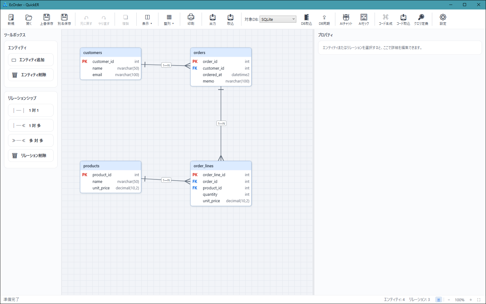
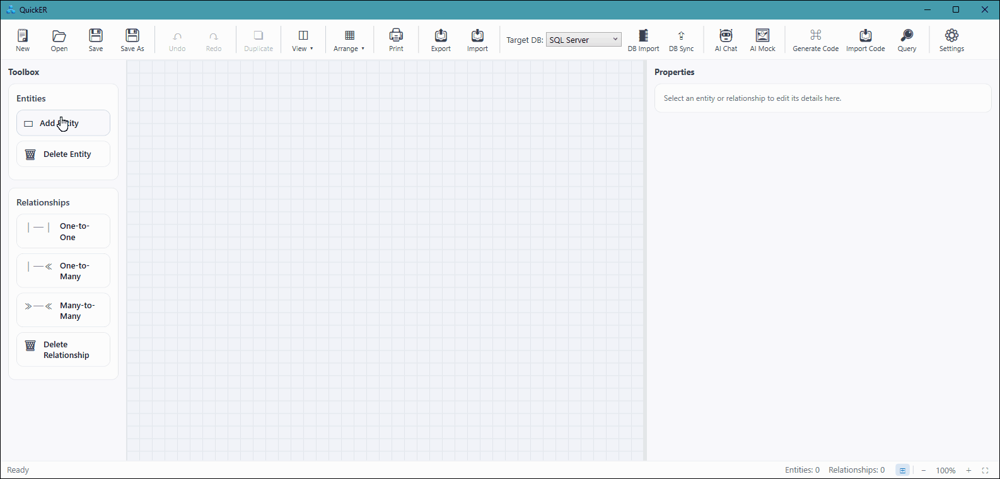
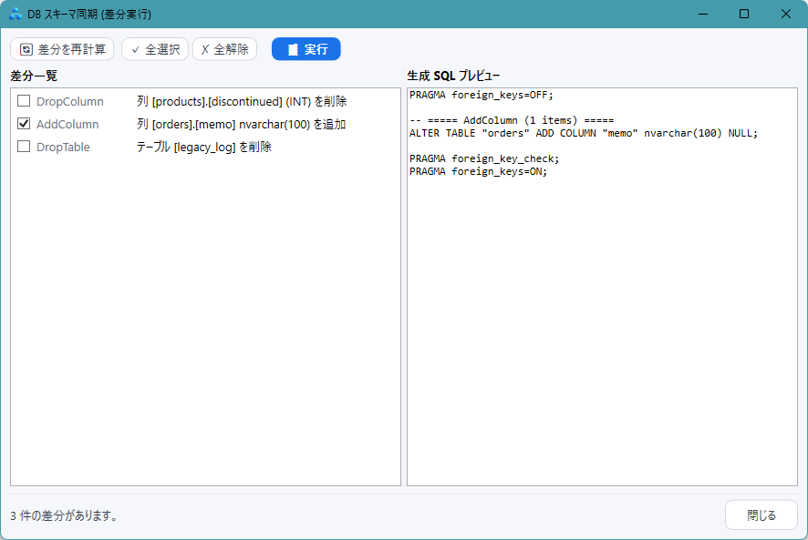
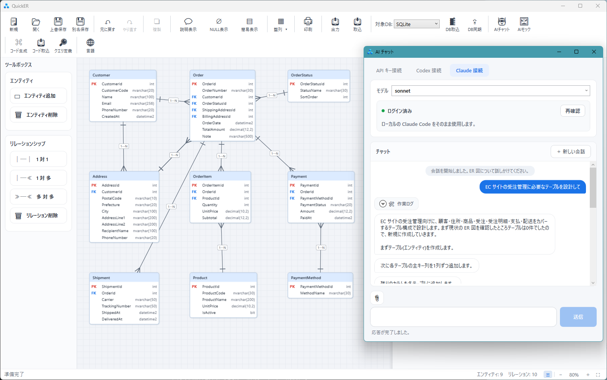
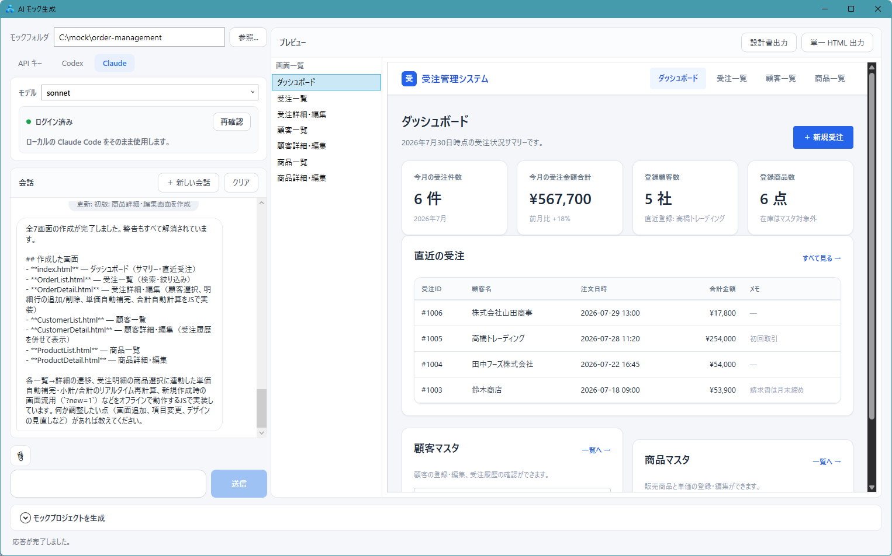

# QuickER

*[English](README.md) | 日本語*

[](https://github.com/kokko-labs/QuickER/actions/workflows/ci.yml)
[](https://github.com/kokko-labs/QuickER/releases)
[](#ライセンス)

## Design once. Generate the rest.

**ER モデルを、データベース、ソースコード、設計ドキュメントの正本（*Single Source of Truth*）に**

QuickER は、ER モデルを軸に .NET で業務アプリケーションを開発するための Windows 用 ツールです。
GUI や AI チャットで ER モデルを作成・編集し、データベースとの間でスキーマの変更を相互に反映できます。

作成した ER モデルから DDL、C# コード、画面モック、テーブル定義書などを生成します。
同じスキーマをエンティティクラス、UI 用モデル、設計書へ書き写す作業が減り、図と実装のずれも抑えやすくなります。

**ER 図の更新漏れも、スキーマ定義の重複も、もうなくしましょう。**



- 実データベースからのスキーマ取込と差分同期
- SQL Server / PostgreSQL / MySQL / Oracle / SQLite に対応
- C# コードを生成（Entity / EditModel / Mapper / ValueObject / Repository）
- AI チャットによる ER モデルの生成・編集と画面モック生成
- MCP サーバによる AI エージェント連携（Claude Code・Codex 等）
- DBML / Mermaid / Excel 定義書との入出力
- git で差分を管理できる JSON 保存形式
- GUI と CLI の両方から利用可能

## クイックスタート

### 1. QuickER を起動して図を開く

[GitHub Releases](https://github.com/kokko-labs/QuickER/releases) から Setup.exe または Portable zip を入手して起動します（詳細は[インストール](#インストール)。ソースコードから起動する場合は `dotnet run --project src/QuickER.Gui`）。

リポジトリをクローンし、同梱サンプルの ER モデル `samples/ec-order/EcOrder.json` を開いてみてください（冒頭のスクリーンショットの図です）。

```powershell
git clone https://github.com/kokko-labs/QuickER.git
cd QuickER
```

### 2. 生成コードを動かす

この図から生成した DDL と C# コードはチェックイン済みで、外部データベースなしでそのまま実行できます（.NET 10 SDK が必要です）。

```powershell
dotnet run --project samples/ec-order/EcOrderSample
```

```text
[Setup] Created the SQLite file DB (ec-order.db) from the EcOrder.sql DDL.
[1] Registered 2 customers and 2 products.
[2] Graph-saved 1 order + 2 order lines (records saved: 3).
[3] Fetched the order with a Where expression tree + Include:
...
All scenarios succeeded.
```

サンプルには、次のファイルが含まれています。

- [EcOrder.json](samples/ec-order/EcOrder.json) — GUI で編集できる ER モデル
- [EcOrder.sql](samples/ec-order/EcOrder.sql) — ER モデルから生成した SQLite DDL
- [EcOrder.g.cs](samples/ec-order/EcOrderSample/Generated/EcOrder.g.cs) — 生成された C# コード
- [Program.cs](samples/ec-order/EcOrderSample/Program.cs) — CRUD、グラフ保存、Include、EditModel / Mapper による編集、生 SQL、削除カスケードの実行例

詳しくは [EC 注文サンプル](samples/ec-order/README.ja.md) を参照してください。図の編集からコード生成までを手を動かして一巡するには、[チュートリアル](docs/getting-started.ja.md)へ進んでください。

## ER モデルを視覚的に設計する

crow's foot 記法を使用して、テーブル、列、主キー、外部キー、一意制約、関連を視覚的に設計できます。

- 1 対 1 / 1 対多 / 多対多
- 複合主キー
- 一意制約（単一列・複合）
- Cascade / SetNull / NoAction
- Undo / Redo
- ズーム、パン、ミニマップ
- エンティティ検索
- 関連のハイライト
- 複数選択と一括操作
- PK / FK のみを表示する簡易表示

詳しくは [ER 図の編集](docs/er-editor.ja.md) を参照してください。



## 実データベースと往復する

既存データベースからスキーマを取り込み、ER モデルとして編集できます。
ER モデルとデータベースの差分を検出し、同期用 SQL を生成することもできます。

| DBMS       | スキーマ取込 | 差分同期 | DDL 生成 | 方言切替 |
| ---------- | ------ | ---- | ------ | ---- |
| SQL Server | ✅      | ✅    | ✅      | ✅    |
| PostgreSQL | ✅      | ✅    | ✅      | ✅    |
| MySQL      | ✅      | ✅    | ✅      | ✅    |
| Oracle     | ✅      | ✅    | ✅      | ✅    |
| SQLite     | ✅      | ✅    | ✅      | ✅    |

図ごとに対象 DBMS を保持し、途中で別の SQL 方言（DBMS ごとの型・構文の差異）へ切り替えることもできます。型は可能な範囲で自動変換され、変換できない型は警告されます。

詳しくは [データベース連携](docs/database.ja.md) を参照してください。



## C# コードを生成する

ER モデルから、アプリケーション開発に必要な C# コードを生成できます。

基本生成:

- Entity
- EditModel
- Entity と EditModel の Mapper

DataAnnotations と DB 定義メタ属性（方言中立の型トークンと説明）は既定で付与されます。ランタイムがリフレクションで参照するため、Repository を生成する構成では必須です。

オプション生成:

- QuickER 版 Repository（ADO ベースの軽量実装）
- EF Core の DbContext と EF Core 版 Repository
- 列ごとの値オブジェクト
- 名前付きクエリ
- リモート用 Repository インターフェイス
- HTTP + JSON クライアント
- ASP.NET Core Minimal API サーバー
- SQL Server とローカル SQLite の双方向同期（高速な洗い替え付き）

EditModel は画面からの入力値を文字列として受け取り、検証に成功した値だけを確定値として保持し、失敗した場合はエラー情報を保持します。Mapper はその確定値と変更状態だけをエンティティへ反映するため、不正な入力値がエンティティに入り込みません。

生成コードは特定の UI フレームワークに依存しません。WPF、Blazor、ASP.NET Core など、任意の .NET アプリケーションから利用できます。
EditModel と Mapper の動きは、同梱サンプルの [Program.cs](samples/ec-order/EcOrderSample/Program.cs) を実行して確認できます。

詳しくは [生成コードの使い方](docs/code-generation.ja.md) を参照してください。

## データアクセス方式

生成ダイアログでは、データアクセス層を次の 3 方式から選択できます。

| 選択肢                      | 対象 DB               | 用途                                                 |
| ------------------------ | ------------------- | -------------------------------------------------- |
| **なし**                   | —                   | Entity / EditModel / Mapper のみを生成し、データアクセスは独自に実装する |
| **QuickER 版 Repository** | SQL Server / SQLite | ADO ベースの軽量な Repository を使用する                       |
| **EF Core 版 Repository** | 対応する 5 DBMS         | DbContext と LINQ を使用する                             |

> **前提**: Repository 生成は、主キーが単一列かつアプリケーション側で採番するテーブルが対象です。複合主キーや DB 自動採番のテーブルでは、Entity / EditModel のみを利用できます。

QuickER 版 Repository は、次の機能を備えています。

- 式木による検索
- `Include` / `ThenInclude`
- グラフ保存
- 一括操作
- グラフ保存時の競合検出（更新対象の行が存在しない場合。`rowversion` 比較による排他制御は対象外）
- 生 SQL の実行

QuickER 版 Repository と EF Core 版 Repository は、同じインターフェイスを実装します。アプリケーション側をインターフェイスに依存させることで、DI 登録を変更して実装を切り替えられます（GUI ではどちらか一方を生成します。両方を同時に生成するには CLI または設定ファイルを使用します）。

```csharp
// QuickER 版 Repository
services.AddGeneratedSqliteRepositories(connectionString);

// EF Core 版 Repository
services.AddGeneratedEfCoreRepositories(
    options => options.UseSqlite(connectionString));
```

## 値オブジェクト

値オブジェクト生成を有効にすると、列ごとに専用の型が生成されます。
例えば、顧客 ID と商品 ID はどちらもデータベース上では整数ですが、C# 上では別の型として扱われます。

```csharp
CustomerIdValue customerId;
ProductIdValue productId;
```

異なる種類の ID を誤って渡した場合は、コンパイルエラーになります。
文字列型の主キーを表す値オブジェクトでは、`UseGuidKeyForStringPrimaryKey` を有効にするとキーを GUID で採番できます。採番ロジックを書かずに、Repository 生成の前提（アプリケーション側での採番）を満たせます。

最大文字数や `decimal` の桁数など、列定義から判断できる検証コードも生成されます。追加の検証や表示名は partial クラスで拡張できます。

## 名前付きクエリ

検索条件、並び順、ページング、射影を ER モデルに保存し、型付きの Repository メソッドとして生成できます。

```text
CustomerId = @customerId AND Memo LIKE @keyword
```

この定義から、次のようなメソッドが生成されます。

```csharp
GetByCustomerAsync(
    int customerId,
    string keyword,
    CancellationToken cancellationToken = default);
```

同じ名前付きクエリが、QuickER 版 Repository と EF Core 版 Repository の両方へ生成されます。

## 3 階層構成

オプションを有効にすると、データベースへ直接接続する構成に加えて、Web サービスを経由する構成を生成できます。

```text
Client
  │
  │ HTTP + JSON
  ▼
ASP.NET Core Minimal API
  │
  ▼
Database
```

次のコードが生成されます。

- リモート用 Repository インターフェイス
- `HttpClient` ベースのクライアント
- ASP.NET Core Minimal API のエンドポイント（DI 登録済みの Repository へ委譲）
- 例外情報の変換と復元

アプリケーション側がリモート用インターフェイスに依存していれば、DI 登録を変更して、DB 直結と Web サービス経由を切り替えられます。

動作例は [3 階層構成サンプル](samples/ec-order-remote/README.ja.md) を参照してください。

## AI チャット

AI と対話しながら ER モデルを作成、編集できます。
例えば、次のように指示できます。

```text
EC サイトの受注管理に必要なテーブルを設計して
```

生成された ER モデルは通常の編集操作で確認、修正できます。

対応する接続方式:

- OpenAI API
- Anthropic API
- ローカル LLM（OpenAI 互換 API：Ollama・LM Studio・vLLM など）
- Codex
- Claude Code
- Copilot（GitHub Copilot CLI）



設定方法は [AI チャットの設定](docs/ai-chat.ja.md) を参照してください。

## AI モック生成

ER モデルを読ませて、業務画面の Web モック（HTML）を対話で作成できます。
生成された画面は「モックフォルダ」（mock.json + 画面ごとの HTML + 共有 style.css）へライブ保存され、ダイアログ内のプレビューで画面間の遷移も確かめられます。



- 会話は「画面構成の提案 → 合意 → 生成」と進み、修正指示で作り込めます
- 関係者への共有用に、全画面を 1 ファイルへまとめた単一 HTML と、画面一覧・遷移図・CRUD 表付きの設計書を出力できます
- 生成したモックを土台に、WPF / Blazor のモックプロジェクトを生成する第 2 ステップもあります。データ層は ER モデルから機械的に生成し、画面の UI は AI が実装し、最後に QuickER が `dotnet build` で結果を確認します。この工程は PoC やプロトタイピングの補助という位置付けで、AI のモデルと接続方式によってはエラーが残ることがあります

接続方式は AI チャットと共通です。

## インポートとエクスポート

### インポート

- 実データベース
- DBML
- Mermaid
- Excel テーブル定義書
- C# コード（IncludeDataAnnotations ON で生成した本体 .g.cs）

### エクスポート

- SQL DDL
- DBML
- Mermaid
- Excel テーブル定義書
- HTML テーブル定義書
- スキーマ JSON（配置情報なし・再取込可能）
- PNG
- SVG
- 印刷 / PDF

ER モデルを修正してから定義書を再出力することで、設計とドキュメントの不一致を防げます。

各形式の対応範囲は [インポートとエクスポート](docs/import-export.ja.md) を参照してください。

## git で管理できる保存形式

QuickER の ER モデルは、1 つの JSON ファイルとして保存されます。
JSON 内では、テーブルや列などの意味モデルと、座標や色などの表示情報を分離しています。

これにより、ER モデルをソースコードと同じリポジトリへ保存し、コミット履歴やプルリクエストで変更内容を確認できます。
DBML や Mermaid を介して、テキスト中心のワークフローと組み合わせることもできます。

## インストール

### GUI

GitHub Releases では、次の形式を提供します。

| チャンネル        | Setup                        | Portable                        | 必要なランタイム                                     |
| ------------ | ---------------------------- | ------------------------------- | -------------------------------------------- |
| **Full**（推奨） | `QuickER-win-full-Setup.exe` | `QuickER-win-full-Portable.zip` | 不要                                           |
| **Lite**     | `QuickER-win-lite-Setup.exe` | `QuickER-win-lite-Portable.zip` | .NET 10 Desktop Runtime、ASP.NET Core Runtime |

Portable 版は ZIP を展開し、`QuickER.exe` を実行してください。

ソースコードから起動する場合:

```powershell
dotnet run --project src/QuickER.Gui
```

### CLI

NuGet 公開後は、dotnet tool としてインストールできます。

```powershell
dotnet tool install --global QuickER.Cli
```

ER モデルからコードを生成する例:

```powershell
quicker generate `
  --schema diagram.json `
  --out ./Generated `
  --provider sqlserver
```

実データベースから直接コードを生成する例:

```powershell
quicker scaffold `
  --provider sqlserver `
  --connection "..." `
  --out ./Generated
```

生成済み C# コードから ER 図 JSON（スキーマのみ・layout キーなし）を復元する例:

```powershell
quicker reverse `
  --source ./Generated/Model.g.cs `
  --out diagram.json `
  --provider sqlserver
```

未公開の間は、ソースコードから実行してください。

```powershell
dotnet run --project src/QuickER.Cli -- generate ...
```

詳しくは [CLI リファレンス](docs/cli.ja.md) を参照してください。

## なぜ ER モデルを正本にするのか

QuickER は、ER モデルをデータベース、コード、ドキュメントの single source of truth として扱います。
その背景や、コードファーストとの違い、AI と人間の役割分担については、[QuickER が ER モデルを正本にする理由](docs/overview.ja.md) を参照してください。

## ドキュメント

- [QuickER が ER モデルを正本にする理由](docs/overview.ja.md)
- [チュートリアル（設計から実行まで）](docs/getting-started.ja.md)
- [ER 図の編集](docs/er-editor.ja.md)
- [データベース連携](docs/database.ja.md)
- [インポートとエクスポート](docs/import-export.ja.md)
- [CLI リファレンス](docs/cli.ja.md)
- [生成コードの使い方](docs/code-generation.ja.md)
- [AI チャットの設定](docs/ai-chat.ja.md)
- [MCP サーバ（quicker mcp）](docs/mcp.ja.md)
- [EC 注文サンプル](samples/ec-order/README.ja.md)
- [3 階層構成サンプル](samples/ec-order-remote/README.ja.md)
- [変更履歴](CHANGELOG.ja.md)

## 開発

QuickER 本体のビルドとテストには、Windows と .NET 10 SDK が必要です。

```powershell
dotnet build QuickER.slnx
dotnet test QuickER.slnx
```

SQL Server、PostgreSQL、MySQL、Oracle の統合テストには Docker を使用します。Docker が利用できない環境では、該当するテストは自動的にスキップされます。
SQLite のテストには実際のファイルデータベースを使用します。

## サポートとコントリビューション

QuickER は個人で開発しています。
サポートはベストエフォートで行い、原則として最新版のみを対象とします。

バグ報告や機能要望は GitHub Issues へお寄せください。日本語と英語のどちらでも受け付けています。
Pull Request を作成する場合は、事前に Issue で変更内容をご相談ください。

- [コントリビューションガイド](CONTRIBUTING.ja.md)
- [セキュリティポリシー](SECURITY.ja.md)

## ライセンス

QuickER が生成したコードは、インラインで生成されるランタイム部分を含めて利用者の成果物です。生成コードは、QuickER 本体のライセンスによる制限を受けず、商用を含めて自由に利用、改変、配布できます（[LICENSE-NC.md](LICENSE-NC.md) に明示的な許諾として条文化しています）。

QuickER 本体は、プロジェクトごとにライセンスが異なる混合ライセンスのリポジトリです。GitHub が表示する単一のライセンスラベルは、構成の全体を表していません。

| 対象                                       | ライセンス                                               |
| ---------------------------------------- | --------------------------------------------------- |
| ER デザイナ、入出力、DDL 生成、DB 取込・同期、ランタイムパッケージなど | [MIT License](LICENSE)                              |
| AI 機能・コード生成関連プロジェクトと MCP ツール実行ホスト        | [PolyForm Noncommercial 1.0.0](LICENSE-NC.md) ＋追加許諾 |

現行リリースは、公式 GUI・CLI の商用利用を含めて全員が無料で利用できます。ただし、追加許諾の対象は QuickER の**利用**です。対象ソースコードを商用目的で改変することや、改変版を再配布することは含まれません。

将来のバージョンでは、一部機能の有償ライセンス化（たとえば別ライセンスの有償 Pro 機能）を行う可能性があります。その場合も、次の約束は変わりません。

- Entity / EditModel / Mapper の基本生成は、商用利用を含めて恒久的に無料です。
- 既存機能の個人・非商用利用は無料のままです。
- 公開済みバージョンに付与した権利を遡って取り消すことはありません。
- 有償化する場合は事前に告知し、既存利用者には移行期間を設けます。

これらの約束は [LICENSE-NC.md](LICENSE-NC.md) の「Additional Grants（追加許諾）」節として条文化されており、現在の商用利用はライセンスファイル自体の許諾に基づきます。

どの配布物にどのライセンスが適用されるか、何ができて何ができないかの平易な解説は [LICENSING.ja.md](LICENSING.ja.md) を参照してください。正式な条件については、必ず [LICENSE](LICENSE) と [LICENSE-NC.md](LICENSE-NC.md) を参照してください。
