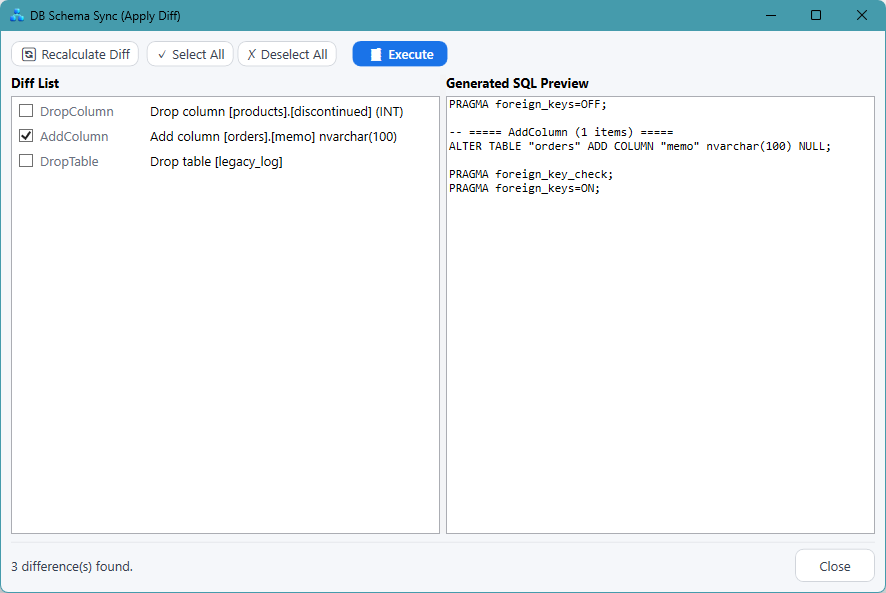
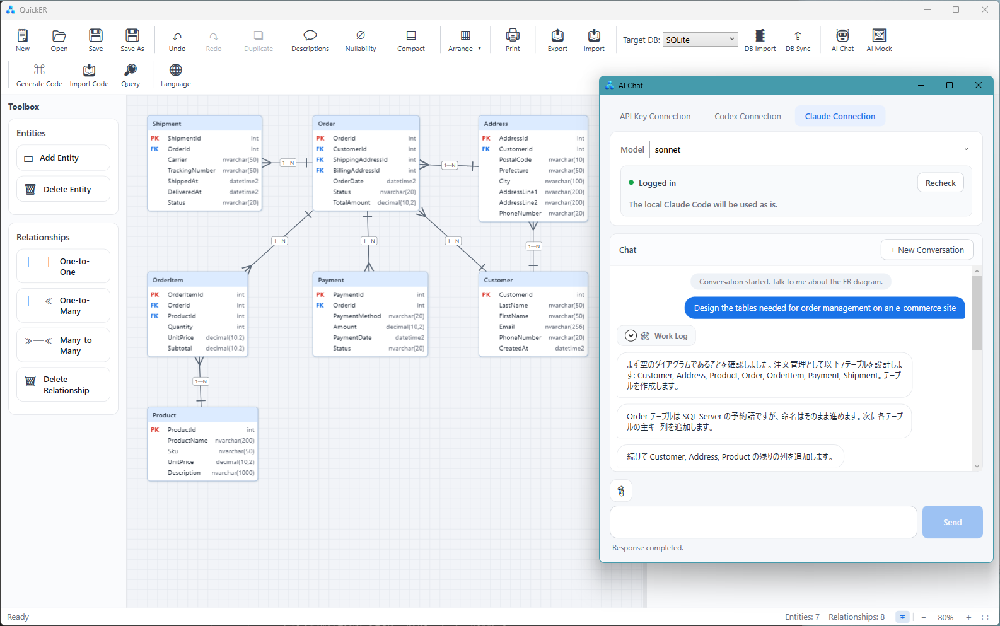

# QuickER

*English | [日本語](README.ja.md)*

[](https://github.com/kokko-labs/QuickER/actions/workflows/ci.yml)
[](https://github.com/kokko-labs/QuickER/releases)
[](#license)

## Design once. Generate the rest.

**Your ER model as the single source of truth for the database, source code, and design documents.**

QuickER is a development-support tool for Windows that connects everything from ER model design, through import and diff sync with live databases, to generating the DDL, source code, and design documents.

There is no need to copy the same schema definition into the DDL, entities, screen models, and design documents over and over. Define the ER model once, and QuickER generates the rest.


- Supports SQL Server / PostgreSQL / MySQL / Oracle / SQLite
- Generates C# code (Entity / EditModel / Mapper / ValueObject / Repository)
- Schema import and diff sync from live databases
- Creates and edits ER models through AI chat
- Integrates with AI agents (Claude Code, Codex, etc.) via an MCP server
- Import/export with DBML / Mermaid / Excel definition documents
- A git-friendly JSON save format
- Available from both the GUI and the CLI

> **No more stale diagrams. No more duplicated definitions.**

## Quick start

### 1. Launch QuickER and open a diagram

Get the Setup.exe or the Portable zip from [GitHub Releases](https://github.com/kokko-labs/QuickER/releases) and launch it (see [Install](#install) for details; to run from source, use `dotnet run --project src/QuickER.Gui`).

Clone the repository and open the bundled sample ER model `samples/ec-order/EcOrder.json` — the exact diagram in the screenshot above.

```powershell
git clone https://github.com/kokko-labs/QuickER.git
cd QuickER
```

### 2. Run the generated code

The DDL and C# code generated from this diagram are checked in, and they run as-is with no external database (the .NET 10 SDK is required).

```powershell
dotnet run --project samples/ec-order/EcOrderSample
```

```text
[Setup] Created the SQLite file DB (ec-order.db) from the EcOrder.sql DDL.
[1] Registered 2 customers and 2 products.
[2] Graph-saved 1 order + 2 order lines (records saved: 3).
[3] Fetched the order with a Where expression tree + Include:
...
All scenarios succeeded.
```

What's in the sample:

- [EcOrder.json](samples/ec-order/EcOrder.json) — the ER model you can edit in the GUI
- [EcOrder.sql](samples/ec-order/EcOrder.sql) — the SQLite DDL generated from the ER model
- [EcOrder.g.cs](samples/ec-order/EcOrderSample/Generated/EcOrder.g.cs) — the generated C# code
- [Program.cs](samples/ec-order/EcOrderSample/Program.cs) — runnable examples of CRUD, graph save, Include, editing through the EditModel / Mapper, raw SQL, and delete cascade

See [the EC order sample](samples/ec-order/README.md) for details. To walk through the loop from editing the diagram to generating code with your own hands, continue to the [tutorial](docs/getting-started.md).

## Design ER models visually

Design tables, columns, primary keys, foreign keys, and relationships visually in crow's foot notation.

- One-to-one / one-to-many / many-to-many
- Composite primary keys
- Cascade / SetNull / NoAction
- Undo / Redo
- Zoom, pan, and minimap
- Entity search
- Relationship highlighting
- Multi-select with bulk operations
- A compact view showing PK / FK columns only

See [ER diagram editing](docs/er-editor.md) for details.


## Round-trip with live databases

Import the schema from an existing database and edit it as an ER model.
You can also detect the differences between the ER model and the database and generate a sync SQL script.

| DBMS       | Schema import | Diff sync | DDL generation | Dialect switch |
| ---------- | :-: | :-: | :-: | :-: |
| SQL Server | ✅ | ✅ | ✅ | ✅ |
| PostgreSQL | ✅ | ✅ | ✅ | ✅ |
| MySQL      | ✅ | ✅ | ✅ | ✅ |
| Oracle     | ✅ | ✅ | ✅ | ✅ |
| SQLite     | ✅ | ✅ | ✅ | ✅ |

Each diagram keeps its target DBMS, and you can switch to another SQL dialect at any time. Types are converted automatically where possible, and types that cannot be converted are flagged with a warning.

See [Database round-tripping](docs/database.md) for details.



## Generate C# code

From the ER model, generate the C# code your application development needs.

Always generated:

- Entity
- EditModel
- The Mapper between Entity and EditModel
- DataAnnotations and DB definition metadata attributes (dialect-neutral type tokens and descriptions)

Optionally generated:

- Repository
- An EF Core DbContext and Repository implementations
- Per-column value objects
- Named queries
- Remote Repository interfaces
- An HTTP + JSON client
- An ASP.NET Core Minimal API server

The generated code does not depend on any particular UI framework; use it from any .NET application — WPF, Blazor, ASP.NET Core, and so on.
You can see the EditModel and Mapper in action by running the bundled sample's [Program.cs](samples/ec-order/EcOrderSample/Program.cs).

See [Using the generated code](docs/code-generation.md) for details.

## Data access options

The generation dialog lets you choose the data-access layer from three options.

| Option | Target DB | Use |
|---|---|---|
| **None** | — | Generate Entity / EditModel / Mapper only, and implement data access yourself |
| **QuickER Repository** | SQL Server / SQLite | Use a lightweight ADO-based Repository |
| **EF Core** | The 5 supported DBMS | Use a DbContext and LINQ |

The QuickER Repository ships with:

- Expression-tree queries
- `Include` / `ThenInclude`
- Graph save
- Bulk operations
- Optimistic concurrency
- Raw SQL execution

The QuickER Repository and the EF Core implementation implement the same Repository interfaces. Keep your application code dependent on the interfaces, and you can switch implementations by changing the DI registration.

```csharp
// QuickER Repository
services.AddGeneratedSqliteRepositories(connectionString);

// EF Core Repository
services.AddGeneratedEfCoreRepositories(
    options => options.UseSqlite(connectionString));
```

## Value objects

Enable value-object generation and a dedicated type is generated per column.
For example, a customer ID and a product ID are both integers in the database, but they become distinct types in C#.

```csharp
CustomerIdValue customerId;
ProductIdValue productId;
```

Passing the wrong kind of ID by mistake becomes a compile-time error.

Validation code that can be derived from the column definitions — maximum lengths, `decimal` precision, and so on — is generated as well. Add custom validation and display names through partial classes.

## Named queries

Store search conditions, ordering, paging, and projections in the ER model, and generate them as typed Repository methods.

```text
CustomerId = @customerId AND Memo LIKE @keyword
```

From this definition, a method like the following is generated.

```csharp
GetByCustomerAsync(
    int customerId,
    string keyword,
    CancellationToken cancellationToken = default);
```

The same named query is generated for both the QuickER Repository and the EF Core implementation.

## Three-tier architecture

Enable the option and, in addition to the direct-database configuration, QuickER generates a configuration that goes through a web service.

```text
Client
  │
  │ HTTP + JSON
  ▼
ASP.NET Core Minimal API
  │
  ▼
Database
```

The following code is generated:

- Remote Repository interfaces
- An `HttpClient`-based client
- ASP.NET Core Minimal API endpoints (delegating to the DI-registered repositories)
- Conversion and restoration of exception information

As long as your application code depends on the remote interfaces, you can switch between direct DB access and going through the web service by changing the DI registration.

See [the three-tier sample](samples/ec-order-remote/README.md) for a working example.

## AI chat

Create and edit ER models in conversation with an AI.
For example, you can say:

```text
Design the tables needed for order management on an e-commerce site
```

The generated ER model can be reviewed and refined with the normal editing operations.

Supported connection methods:

- OpenAI API
- Anthropic API
- Local LLMs (OpenAI-compatible APIs: Ollama, LM Studio, vLLM, etc.)
- Codex
- Claude Code

It can also generate web mockup screens (HTML) from the ER model.



See [Configuring AI chat](docs/ai-chat.md) for how to set it up.

## Import and export

### Import

- Live databases
- DBML
- Mermaid
- Excel table definition documents
- C# code (a main `.g.cs` generated with `IncludeDataAnnotations` ON)

### Export

- SQL DDL
- DBML
- Mermaid
- Excel table definition documents
- HTML table definition documents
- Schema JSON (layout-free, re-importable)
- PNG
- SVG
- Print / PDF

Fix the ER model and re-export the definition documents, and design and documentation never drift apart.

See [Import and export](docs/import-export.md) for what each format covers.

## A save format you can manage with git

A QuickER ER model is saved as a single JSON file.
Inside the JSON, the semantic model (tables and columns) is separated from the visual information (coordinates and colors).

This lets you keep ER models in the same repository as your source code and review changes through commit history and pull requests.
Via DBML and Mermaid, it also combines with text-centric workflows.

## Install

### GUI

GitHub Releases provides the following packages.

| Channel | Setup | Portable | Required runtime |
| ------------ | ---------------------------- | ------------------------------- | -------------------------------------------- |
| **Full** (recommended) | `QuickER-win-full-Setup.exe` | `QuickER-win-full-Portable.zip` | none |
| **Lite**     | `QuickER-win-lite-Setup.exe` | `QuickER-win-lite-Portable.zip` | .NET 10 Desktop Runtime and ASP.NET Core Runtime |

The Setup edition supports automatic updates after installation.
For the Portable edition, extract the ZIP and run `QuickER.exe`.

To run from source:

```powershell
dotnet run --project src/QuickER.Gui
```

### CLI

Once published to NuGet, you can install it as a dotnet tool.

```powershell
dotnet tool install --global QuickER.Cli
```

Generating code from an ER model:

```powershell
quicker generate `
  --schema diagram.json `
  --out ./Generated `
  --provider sqlserver
```

Generating code directly from a live database:

```powershell
quicker scaffold `
  --provider sqlserver `
  --connection "..." `
  --out ./Generated
```

Recovering an ER diagram JSON (schema only, no layout key) from generated C# code:

```powershell
quicker reverse `
  --source ./Generated/Model.g.cs `
  --out diagram.json `
  --provider sqlserver
```

Until it is published, run it from source.

```powershell
dotnet run --project src/QuickER.Cli -- generate ...
```

See the [CLI reference](docs/cli.md) for details.

## Design philosophy

QuickER treats the ER model as the single source of truth for the database, the code, and the documents.
For the background, how this differs from code-first, and the division of labor between AI and humans, see [the design philosophy of QuickER](docs/overview.md).

## Documentation

- [The design philosophy of QuickER](docs/overview.md)
- [Tutorial (from design to running code)](docs/getting-started.md)
- [ER diagram editing](docs/er-editor.md)
- [Database round-tripping](docs/database.md)
- [Import and export](docs/import-export.md)
- [CLI reference](docs/cli.md)
- [Using the generated code](docs/code-generation.md)
- [Configuring AI chat](docs/ai-chat.md)
- [MCP server (quicker mcp)](docs/mcp.md)
- [The EC order sample](samples/ec-order/README.md)
- [The three-tier sample](samples/ec-order-remote/README.md)
- [Changelog](CHANGELOG.md)

## Development

Building and testing QuickER itself requires Windows and the .NET 10 SDK.

```powershell
dotnet build QuickER.slnx
dotnet test QuickER.slnx
```

The integration tests for SQL Server, PostgreSQL, MySQL, and Oracle use Docker. In environments where Docker is not available, those tests are skipped automatically.
The SQLite tests use a real file database.

## Support & contributing

QuickER is developed by a single person.
Support is best-effort and, as a rule, covers the latest version only.

Please file bug reports and feature requests as GitHub Issues; both Japanese and English are welcome.
Before opening a pull request, please discuss the change in an Issue first.

- [Contributing guide](CONTRIBUTING.md)
- [Security policy](SECURITY.md)

## License

Code that QuickER generates — including the inlined runtime portion — is your work product. Generated code is not restricted by QuickER's own licenses, and you may use, modify, and distribute it freely.

QuickER itself applies the following licenses per project.

| Scope | License |
| ---------------------------------------- | --------------------------------------------------- |
| The ER designer, import/export, DDL generation, DB import/sync, the runtime packages, and so on | [MIT License](LICENSE) |
| The AI features and the code-generation projects | [PolyForm Noncommercial 1.0.0](LICENSE-NC.md) + additional grants |

Today, the AI features and code generation are free for everyone, including commercial use.

In the future, the AI features and part of the DB-access code generation may become paid-licensed for commercial use only. Even then, personal and non-commercial use, and the basic generation of Entity / EditModel / Mapper, will remain free. If paid licensing is introduced, it will be announced in advance, with a transition period for existing users.

These promises are codified as the "Additional Grants" section of [LICENSE-NC.md](LICENSE-NC.md), and commercial use today rests on the grants in the license file itself.

For the formal terms, always refer to the license files.
