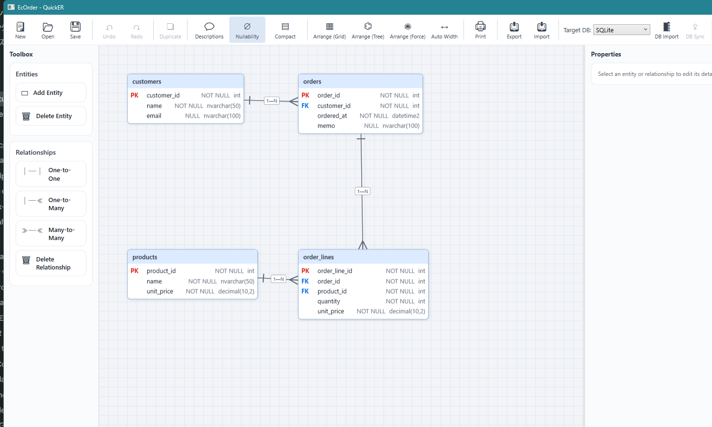

# QuickER

*[日本語](README.ja.md) | English*

*License: [MIT](LICENSE) (core) + [PolyForm NC](LICENSE-NC.md) (AI features and code generation — currently free for everyone, including commercial use). See [License](#license) for details.*

**A Windows ER diagram designer that connects AI-assisted visual ER design × multi-DB round-tripping (import, sync, DDL) × C# code generation (Repository / EF Core) end to end.**

Draw an ER diagram → create a database → generate C# data-access code and run it — all in a single tool, round-tripping between each step. It also imports from and diff-syncs with existing databases, and you can generate and edit diagrams through AI chat.



## Features

- **Visual ER design** — crow's foot notation, one-to-one / one-to-many / many-to-many, composite primary keys, FK referential actions (Cascade / SetNull / NoAction), and comprehensive undo/redo. Zoom, pan, entity search (Ctrl+F), minimap, relationship highlighting, multi-select with bulk operations, and compact view (PK/FK only) keep large diagrams manageable
- **Multi-DB** — schema import, diff sync, and DDL generation across five dialects: SQL Server / PostgreSQL / MySQL / Oracle / SQLite. Each diagram keeps its target DB, and you can switch dialects at any time (types convert automatically; types that cannot be converted are flagged with a warning and can be undone)
- **C# code generation** — in addition to Entity / EditModel / Mapper, choose a data-access layer to generate:
  - **Repository (QuickER)** — a lightweight, minimal-dependency Repository (expression-tree queries, Include, graph save, optimistic concurrency, and a raw-SQL escape hatch)
  - **EF Core** — a DbContext that hosts your existing entities as-is, plus an EF implementation of the same interfaces. Swap it with Repository (QuickER) **by changing a single line of DI registration**
  - **Named queries** — store search-method definitions (condition, ordering, paging, projection) in the diagram and generate them as typed Repository methods (e.g. `GetByCustomerAsync(int customerId, ...)`) for every implementation (Repository (QuickER) / EF Core). Conditions are written in a simple DSL (`CustomerId = @customerId AND Memo LIKE @keyword`, etc.) with live validation in the GUI editor
  - **Remote-capable interfaces (--remote-contracts)** — an option that additionally generates `I{Entity}RemoteRepository` with only the operations that can be served over a web service (CRUD, save, and named queries). `I{Entity}Repository` keeps all methods and inherits it, so existing code is unaffected; keep your application code dependent only on the remote surface and a switch to a remote implementation stays compile-time safe
  - **Three-tier support (--remote-services)** — generates an HTTP + JSON client (`Http{Entity}RemoteRepository`, depending only on the BCL `HttpClient`) and an ASP.NET Core Minimal API server (`MapGeneratedRemoteEndpoints`) for the remote surface. Switch between direct DB access and going through a web service by swapping a single DI registration line; exceptions such as `SaveConflictException` are restored with their original type (the same catch works as with a direct connection)
- **AI chat** — generate and edit ER diagrams through conversation (supports OpenAI / Anthropic API keys, Ollama, Codex, and Claude Code). It can also generate web mockup screens (HTML) from an ER diagram
- **Rich import/export** — import: DBML / Mermaid / Excel definition sheets / live DBs (5 dialects). Export: PNG / SVG / SQL DDL / Mermaid / DBML / Excel definition sheets / vector printing (scale-to-one-page and actual-size PDF)
- **git-friendly save format** — a single JSON file that separates the semantic model (table definitions) from the visual information (coordinates and colors)
- **CLI (dotnet tool)** — generate code without the GUI. `quicker generate` (ER diagram JSON → code) / `quicker scaffold` (direct DB → code)

## Supported DBMS

| DBMS | Schema import | Diff sync | DDL generation | Dialect switch (type conversion) | Notes |
|---|:-:|:-:|:-:|:-:|---|
| SQL Server | ✅ | ✅ | ✅ | ✅ | Descriptions sync with extended properties (MS_Description) |
| PostgreSQL | ✅ | ✅ | ✅ | ✅ | 13 and later |
| MySQL | ✅ | ✅ | ✅ | ✅ | 8.0 and later (MariaDB is not supported) |
| Oracle | ✅ | ✅ | ✅ | ✅ | 19c and later |
| SQLite | ✅ | ✅ | ✅ | ✅ | File DB. Used by the sample |

Import and sync against live databases are continuously verified by real-DB integration tests (SQL Server / PostgreSQL / MySQL / Oracle use real Testcontainers containers; SQLite uses a real file DB).

## Quick start — a working sample (no external DB required)

The repository includes a finished sample ([samples/ec-order](samples/ec-order)) that has been round-tripped once through "design → save → generate → build → run." Because it uses a SQLite file DB, **it runs as-is right after cloning, as long as you have the .NET 10 SDK**.

```powershell
git clone https://github.com/kokko-labs/QuickER.git
cd QuickER
dotnet run --project samples/ec-order/EcOrderSample
```

```text
[Setup] Created a SQLite file DB (ec-order.db) from the EcOrder.sql DDL.

[1] Registered 2 customers and 2 products.

[2] Graph-saved 1 order + 2 order lines (records saved: 3).

[3] Fetched the order with a Where expression tree + Include:
    OrderId=1000 CustomerId=1 Memo=First order
    LineId=5000 Product=Coffee beans 200g Qty=2 UnitPrice=980
    LineId=5001 Product=Mug Qty=1 UnitPrice=1500
...
All scenarios succeeded.
```

> Note: the sample console output is emitted in Japanese by the sample program; the above is a translation for reference.

What's in the sample:

- [EcOrder.json](samples/ec-order/EcOrder.json) — the ER diagram you can open in the GUI (the exact diagram in the screenshot above)
- [EcOrder.sql](samples/ec-order/EcOrder.sql) — the SQLite DDL generated from the diagram
- [EcOrder.g.cs](samples/ec-order/EcOrderSample/Generated/EcOrder.g.cs) — the C# code generated from the diagram (Entity / EditModel / Mapper / Repository)
- [Program.cs](samples/ec-order/EcOrderSample/Program.cs) — demonstrates CRUD, graph save, Include, raw-SQL aggregation, and delete cascade with the generated code

### Round-trip it yourself

1. **Design** — open the sample diagram (`samples/ec-order/EcOrder.json`) in the GUI, edit it, and save (e.g., add a column to `products`)
2. **Generate** — replace the code with the CLI:

   ```powershell
   dotnet run --project src/QuickER.Cli -- generate `
     --schema samples/ec-order/EcOrder.json `
     --out samples/ec-order/EcOrderSample/Generated `
     --provider sqlite `
     --config samples/ec-order/quicker.json
   ```

3. **DDL** — export the DDL from the GUI's "Export" and update `EcOrder.sql`
4. **Run** — run it with `dotnet run --project samples/ec-order/EcOrderSample`

See [samples/ec-order/README.md](samples/ec-order/README.md) for details.

## Install / Get it

### GUI (QuickER itself)

- **GitHub Releases** — two channels, each with a Setup.exe (installer, auto-updating) and a Portable zip (extract and run `QuickER.exe`):

  | Channel                | Setup.exe                    | Portable zip                    | Runtime                                                                                                             |
  | ---------------------- | ---------------------------- | ------------------------------- | ------------------------------------------------------------------------------------------------------------------- |
  | **Full** (recommended) | `QuickER-win-full-Setup.exe` | `QuickER-win-full-Portable.zip` | none — bundled                                                                                                       |
  | **Lite**               | `QuickER-win-lite-Setup.exe` | `QuickER-win-lite-Portable.zip` | requires the [.NET 10 Desktop Runtime and ASP.NET Core Runtime](https://dotnet.microsoft.com/download/dotnet/10.0) |

- **From source** — with the `.NET 10 SDK` you can launch it with:

  ```powershell
  dotnet run --project src/QuickER.Gui
  ```

### CLI (the quicker command)

Once published to NuGet, you can install it as a dotnet tool:

```powershell
dotnet tool install --global QuickER.Cli
quicker generate --schema diagram.json --out ./Generated --provider sqlserver
```

Until it is published, run it from source (`dotnet run --project src/QuickER.Cli -- generate ...`).

### Runtime packages (optional)

Generated code is self-contained by default (the runtime is inlined into the output). In `--runtime-packages` mode, which switches the fixed code to NuGet package references, it references `QuickER.Runtime` / `QuickER.Runtime.SqlServer` / `QuickER.Runtime.Sqlite` / `QuickER.Runtime.EntityFrameworkCore`. See [docs/code-generation.md](docs/code-generation.md) for details.

## Choosing a DB-access generation mode

The generation dialog (GUI) offers three data-access choices:

| Option | Target DB | Characteristics / when to use |
|---|---|---|
| **None** (default) | — | Entity / EditModel / Mapper only. You write data access yourself |
| **Repository (QuickER)** | SQL Server / SQLite | A lightweight, minimal-dependency Repository (ADO only). Ships expression-tree queries, `Include`/`ThenInclude`, graph save, bulk, optimistic concurrency (SQL Server rowversion), and raw-SQL execution. Projection / GroupBy / Join are not supported in the expression tree (work around them with raw SQL or EF Core) |
| **EF Core** | 5 dialects | A dialect-neutral `QuickErDbContext` plus an EF implementation of the same Repository interfaces. Migrations are out of scope (schema is the responsibility of DDL generation); it is for connecting to an existing schema only |

Because Repository (QuickER) and EF Core implement **the same interfaces**, you can swap them by changing a single line of DI registration:

```csharp
// Repository (QuickER — the custom SQLite implementation)
services.AddGeneratedRepositories(connectionString);

// EF Core implementation (resolves the same ICustomerRepository, etc.)
services.AddGeneratedEfCoreRepositories(options => options.UseSqlite(connectionString));
```

There is also multi-target generation (keyed DI) that supports SQL Server and SQLite simultaneously. See [docs/code-generation.md](docs/code-generation.md) for details.

## AI chat

From "AI Chat" on the toolbar, you can generate and edit ER diagrams through conversation (e.g., "Design the tables for order management on an e-commerce site"). Connection methods:

- **API key** — OpenAI / Anthropic (Claude). Ollama runs locally and needs no key
- **Codex / Claude Code** — use each CLI's account authentication

See [docs/ai-chat.md](docs/ai-chat.md) for how to configure it.

## Development

Windows and the .NET 10 SDK are required (because the GUI and tests depend on WPF, build and test are Windows-only).

```powershell
dotnet build QuickER.slnx        # build
dotnet test QuickER.slnx         # all tests (real-DB integration tests also run if Docker is available; otherwise they are auto-skipped)
```

## Documentation

> The docs/ pages below are currently written in Japanese.

- [CLI reference (generate / scaffold, quicker.json)](docs/cli.md)
- [Using the generated code (Repository API, EF Core, runtime packages)](docs/code-generation.md)
- [Configuring AI chat](docs/ai-chat.md)
- [The working sample (EC order domain)](samples/ec-order/README.md)
- [The working sample (3-tier — client → HTTP+JSON → server → SQLite)](samples/ec-order-remote/README.md)

## Support & contributing

As a solo project, support is **best-effort** (no promised response times) and covers **the latest version only**. Please file bug reports and feature requests as Issues (Japanese or English are both welcome). For pull requests, please discuss in an Issue first — see [CONTRIBUTING.md](CONTRIBUTING.md) for details, and [SECURITY.md](SECURITY.md) for reporting vulnerabilities.

The change history is in [CHANGELOG.md](CHANGELOG.md).

## License

**Code that QuickER generates (including the inlined runtime portion) is your work product**, and you may use, modify, and distribute it freely with no license restrictions.

The repository itself uses two licenses, split per project:

| Scope | License |
|---|---|
| Core (ER diagram editor, import/export, DDL generation, schema import/diff-sync, the 4 runtime packages, etc.) | [MIT License](LICENSE) — permanently free |
| AI features and code generation (the 7 projects `QuickER.AI` / `AI.UI` / `AI.Chat` / `AI.Mock` / `CodeGen.CSharp` / `CodeGen.UI` / `Cli`) | [PolyForm Noncommercial 1.0.0](LICENSE-NC.md) — see the provisioning policy below |

### Provisioning policy for AI features and code generation (notice about possible future paid licensing)

- **All features are currently free for everyone, including commercial use**
- In the future, **AI features and DB-access code generation (Repository (QuickER) / EF Core / multi-target) may become paid-licensed for commercial use only**
- Even then, we promise the following:
  - **Personal and non-commercial use remains permanently free**
  - **Basic code generation (Entity / EditModel / Mapper) remains permanently free, including commercial use**
  - **If we introduce paid licensing, we will announce it in advance and provide a transition period for existing users**
- The source code of the PolyForm NC portion remains available for use, modification, and redistribution for non-commercial purposes

The promises above are codified as the "Additional Grants" section of [LICENSE-NC.md](LICENSE-NC.md) — the license file itself grants them, so commercial use today rests on the license text, not on this README alone.
