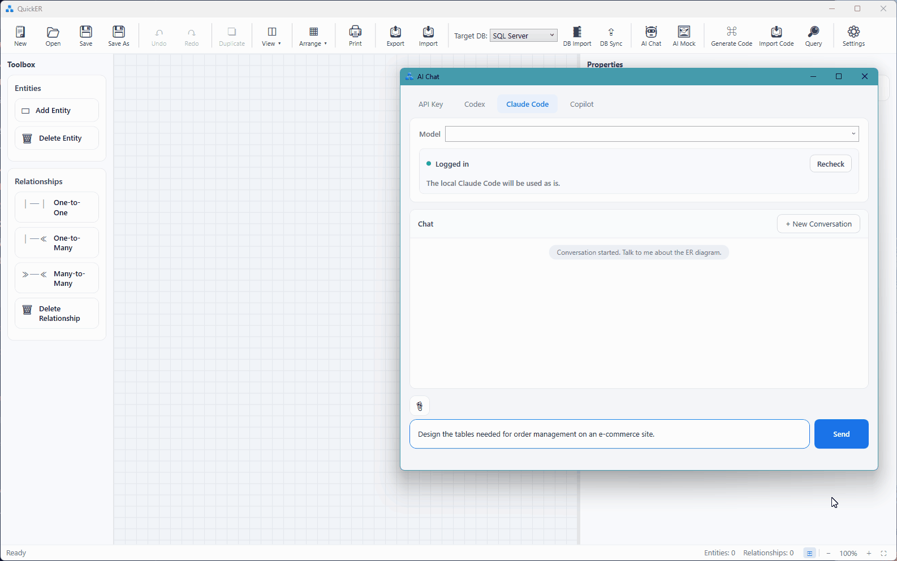
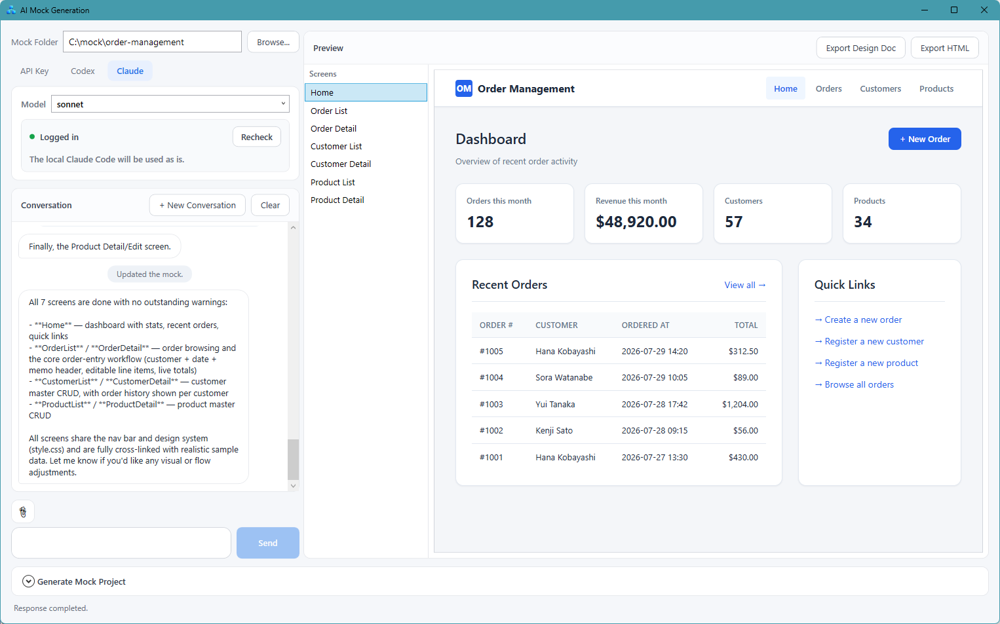

# QuickER

*English | [日本語](README.ja.md)*

[](https://github.com/kokko-labs/QuickER/actions/workflows/ci.yml)
[](https://github.com/kokko-labs/QuickER/releases)
[](https://www.nuget.org/packages/QuickER.Cli)
[](#license)

## Design once. Generate the rest.

**Make the ER model the single source of truth for your database, source code, and design documents**

QuickER is a Windows tool for building .NET business applications around an ER model.
QuickER lets you create and edit ER models through its GUI or AI chat, and bidirectionally synchronize schema changes with live databases.

QuickER generates DDL, C# code, screen mockups, and table definition documents from the ER model.
This reduces the work of copying the same schema into entity classes, UI models, and design documents, helping keep diagrams and implementation in sync.

**When requirements change, update the ER model and regenerate the rest.**


- Schema import and diff sync from live databases
- Supports SQL Server / PostgreSQL / MySQL / Oracle / SQLite
- Generates C# code (Entity / EditModel / Mapper / ValueObject / Repository)
- Creates and edits ER models through AI chat, plus AI mock-screen generation
- Integrates with AI agents via a Model Context Protocol (MCP) server (Claude Code, Codex, etc.)
- Import/export with DBML / Mermaid / Excel definition documents
- A git-friendly JSON save format
- Available from both the GUI and the CLI
- Open source, and the current release is free for everyone, commercial use included ([License](#license))

The background and a walkthrough with screenshots are in an [introductory article on Zenn](https://zenn.dev/kokkolabs/articles/quicker-ai-chat-er-diagram) (in Japanese).

## Quick start

### 1. Install QuickER

Download and run the [Full installer](https://github.com/kokko-labs/QuickER/releases/latest/download/QuickER-win-full-Setup.exe) (see [Install](#install) for the portable and lite builds).
To run from source, use `dotnet run --project src/QuickER.Gui`.

That is all you need to start creating and editing ER models.
The steps below take the bundled sample through to the generated code.

### 2. Open the bundled sample

The sample lives in the repository, so clone it first (the released build needs this too).

```powershell
git clone https://github.com/kokko-labs/QuickER.git
cd QuickER
```

Open `samples/ec-order/EcOrder.json` in QuickER, the exact diagram in the screenshot above.

### 3. Run the generated code

The DDL and C# code generated from this diagram are checked in, and they run as-is with no external database (the .NET 10 SDK is required).

```powershell
dotnet run --project samples/ec-order/EcOrderSample
```

```text
[Setup] Created the SQLite file DB (ec-order.db) from the EcOrder.sql DDL.
[1] Registered 2 customers and 2 products.
[2] Graph-saved 1 order + 2 order lines (records saved: 3).
[3] Fetched the order with a Where expression tree + Include:
...
All scenarios succeeded.
```

What's in the sample:

- [EcOrder.json](samples/ec-order/EcOrder.json): the ER model you can edit in the GUI
- [EcOrder.sql](samples/ec-order/EcOrder.sql): the SQLite DDL generated from the ER model
- [EcOrder.g.cs](samples/ec-order/EcOrderSample/Generated/EcOrder.g.cs): the generated C# code
- [Program.cs](samples/ec-order/EcOrderSample/Program.cs): runnable examples of CRUD, graph save, Include, editing through the EditModel / Mapper, raw SQL, and delete cascade

See [the EC order sample](samples/ec-order/README.md) for details.
To walk through the loop from editing the diagram to generating code with your own hands, continue to the [tutorial](docs/getting-started.md).

## Design ER models visually

Design tables, columns, primary keys, foreign keys, unique constraints, and relationships visually in crow's foot notation.

- One-to-one / one-to-many / many-to-many
- Composite primary keys
- Unique constraints (single-column and composite)
- Cascade / SetNull / NoAction
- Undo / Redo
- Zoom, pan, and minimap
- Entity search
- Relationship highlighting
- Multi-select with bulk operations
- A compact view showing PK / FK columns only

See [ER diagram editing](docs/er-editor.md) for details.


## Round-trip with live databases

Import the schema from an existing database and edit it as an ER model.
You can also detect the differences between the ER model and the database and generate a sync SQL script.

| DBMS       | Schema import | Diff sync | DDL generation | Dialect switch |
| ---------- | :-: | :-: | :-: | :-: |
| SQL Server | ✅ | ✅ | ✅ | ✅ |
| PostgreSQL | ✅ | ✅ | ✅ | ✅ |
| MySQL      | ✅ | ✅ | ✅ | ✅ |
| Oracle     | ✅ | ✅ | ✅ | ✅ |
| SQLite     | ✅ | ✅ | ✅ | ✅ |

Each diagram keeps its target DBMS, and you can switch to another SQL dialect at any time.
Types are converted automatically where possible, and types that cannot be converted are flagged with a warning.

See [Database round-tripping](docs/database.md) for details.


## AI chat

Create and edit ER models in conversation with an AI.
For example, you can say:

```text
Design the tables needed for order management on an e-commerce site
```

The generated ER model can be reviewed and refined with the normal editing operations.

Supported connection methods:

- OpenAI API
- Anthropic API
- Local LLMs (OpenAI-compatible APIs: Ollama, LM Studio, vLLM, etc.)
- Codex
- Claude Code
- Copilot (GitHub Copilot CLI)



See [Configuring AI chat](docs/ai-chat.md) for how to set it up.

## AI mock generation

Use AI to generate HTML mockups of business screens from the ER model through conversation.
The generated files are written to a "mock folder" (mock.json + one HTML per screen + a shared style.css) as the conversation proceeds, and the in-dialog preview lets you follow the transitions between screens.



- The conversation proceeds as "propose the screen structure → agree → generate," and you refine the screens with follow-up instructions
- For sharing with stakeholders, export a single HTML that bundles every screen, and a design document with the screen list, a transition diagram, and a CRUD matrix
- As a second step, you can generate a WPF / Blazor mock project from the mock folder.
  QuickER scaffolds the data layer from the ER model, the AI implements the screen UI, and QuickER checks the result by running `dotnet build`.
  This step is an aid for PoCs and prototyping, so build errors may remain, depending on the AI model and the connection mode

The connection methods are shared with the AI chat.

## Import and export

| Format | Export | Import |
| --- | --- | --- |
| Live databases | ✅ | ✅ |
| SQL DDL | ✅ | — |
| C# code | ✅ | ✅ |
| Schema JSON | ✅ | ✅ |
| DBML | ✅ | ✅ |
| Mermaid | ✅ | ✅ |
| Excel definition documents | ✅ | ✅ |
| HTML definition documents | ✅ | — |
| PNG / SVG | ✅ | — |
| Print / PDF | ✅ | — |

Export to a live database means writing the changes back through diff sync.
C# code is exported by the code generation feature, and the import target is a main `.g.cs` generated with `IncludeDataAnnotations` ON.
Schema JSON carries no layout, so an imported diagram is arranged automatically.

Update the ER model and re-export the definition documents to keep the design and the documentation from drifting apart.

See [Import and export](docs/import-export.md) for what each format covers.

## A save format you can manage with git

A QuickER ER model is saved as a single JSON file.
Inside the JSON, the semantic model (tables and columns) is separated from the visual information (coordinates and colors).

This lets you keep ER models in the same repository as your source code and review changes through commit history and pull requests.
Via DBML and Mermaid, it also combines with text-centric workflows.

## Generate C# code

From the ER model, generate the C# code your application development needs.

Always generated:

| Output | Description |
| --- | --- |
| Entity | A POCO class per table |
| EditModel | A model for screen binding that holds the raw input and its validation errors |
| Mapper | Converts between an Entity and an EditModel |

Optionally generated:

| Output | Description |
| --- | --- |
| QuickER Repository | A lightweight, ADO-based Repository (SQL Server / SQLite) |
| EF Core Repository | A DbContext and a Repository backed by EF Core (all five supported databases) |
| Value objects | A dedicated type per column, so passing the wrong kind of value fails to compile |
| Named queries | Turns the search conditions, ordering, and projections saved in the diagram into typed Repository methods |
| Remote Repository interfaces | A contract limited to the operations that can cross a network boundary |
| HTTP + JSON client | An implementation that calls the remote contract over HTTP |
| ASP.NET Core Minimal API server | Endpoints that expose the remote contract |
| Bidirectional sync | Sync between a SQL Server database and a local SQLite copy: replaying offline edits, fetching server changes, and a fast full reload |

DataAnnotations and DB definition metadata attributes (dialect-neutral type tokens and descriptions) are added by default.
They are required whenever a Repository is generated, since the runtime reads them by reflection.

The EditModel accepts screen input as strings, keeps values that pass validation as confirmed values, and holds error information for those that fail.
The Mapper applies only the confirmed values and change state to the entity, preventing invalid input from entering the entity.

The generated code does not depend on any particular UI framework.
Use it from any .NET application: WPF, Blazor, ASP.NET Core, and so on.
You can see the EditModel and Mapper in action by running the bundled sample's [Program.cs](samples/ec-order/EcOrderSample/Program.cs).

[Data access options](#data-access-options), [value objects](#value-objects), [named queries](#named-queries), and the [three-tier architecture](#three-tier-architecture) each get their own section below.

See [Using the generated code](docs/code-generation.md) for details.

## Data access options

The generation dialog lets you choose the data-access layer from three options.

| Option | Target DB | Use |
|---|---|---|
| **None** | — | Implement data access yourself |
| **QuickER Repository** | SQL Server / SQLite | Use a lightweight ADO-based Repository |
| **EF Core Repository** | The 5 supported DBMS | Use a DbContext and LINQ |

> **Prerequisite**: Repository generation targets tables whose primary key is a single, application-assigned column. Tables with a composite primary key or DB auto-numbering can use the Entity / EditModel only.

The QuickER Repository ships with:

- Expression-tree queries
- `Include` / `ThenInclude`
- Graph save
- Bulk operations
- Conflict detection on graph save (when the target row no longer exists; concurrency control by `rowversion` comparison is out of scope)
- Raw SQL execution

The QuickER Repository and the EF Core Repository implement the same interfaces.
Keep your application code dependent on the interfaces, and you can switch implementations by changing the DI registration (the GUI generates one of the two; generating both at once is available through the CLI or a config file).

```csharp
// QuickER Repository
services.AddGeneratedSqliteRepositories(connectionString);

// EF Core Repository
services.AddGeneratedEfCoreRepositories(
    options => options.UseSqlite(connectionString));
```

## Value objects

Enable value-object generation and a dedicated type is generated per column.
For example, a customer ID and a product ID are both integers in the database, but they become distinct types in C#.

```csharp
CustomerIdValue customerId;
ProductIdValue productId;
```

Passing the wrong kind of ID by mistake becomes a compile-time error.
For a value object representing a string primary key, enabling `UseGuidKeyForStringPrimaryKey` mints new keys as GUIDs, which satisfies the application-assigned key prerequisite without any numbering logic of your own.

Validation code that the column definitions imply, such as maximum lengths and `decimal` precision, is generated as well.
Add custom validation and display names through partial classes.

## Named queries

Store search conditions, ordering, paging, and projections in the ER model, and generate them as typed Repository methods.

```text
CustomerId = @customerId AND Memo LIKE @keyword
```

From this definition, a method like the following is generated.

```csharp
GetByCustomerAsync(
    int customerId,
    string keyword,
    CancellationToken cancellationToken = default);
```

The same named query is generated for both the QuickER Repository and the EF Core Repository.

## Three-tier architecture

Enable the option and, in addition to the direct-database configuration, QuickER generates a configuration that goes through a web service.

```text
Client
  │
  │ HTTP + JSON
  ▼
ASP.NET Core Minimal API
  │
  ▼
Database
```

The following code is generated:

- Remote Repository interfaces
- An `HttpClient`-based client
- ASP.NET Core Minimal API endpoints (delegating to the DI-registered Repository)
- Conversion and restoration of exception information

As long as your application code depends on the remote interfaces, you can switch between direct DB access and going through the web service by changing the DI registration.

See [the three-tier sample](samples/ec-order-remote/README.md) for a working example.

## Install

### GUI

Download one of the following.
The links always point to the latest release.

| Channel | Setup | Portable | Required runtime |
| --- | --- | --- | --- |
| **Full** (recommended) | [`QuickER-win-full-Setup.exe`](https://github.com/kokko-labs/QuickER/releases/latest/download/QuickER-win-full-Setup.exe) | [`QuickER-win-full-Portable.zip`](https://github.com/kokko-labs/QuickER/releases/latest/download/QuickER-win-full-Portable.zip) | none |
| **Lite** | [`QuickER-win-lite-Setup.exe`](https://github.com/kokko-labs/QuickER/releases/latest/download/QuickER-win-lite-Setup.exe) | [`QuickER-win-lite-Portable.zip`](https://github.com/kokko-labs/QuickER/releases/latest/download/QuickER-win-lite-Portable.zip) | .NET 10 Desktop Runtime and ASP.NET Core Runtime |

For the Portable edition, extract the ZIP and run `QuickER.exe`.

The installers and update packages are not Authenticode signed, so Windows SmartScreen reports an unknown publisher.
Choose "More info" and then "Run anyway" to proceed.
The installed edition checks GitHub Releases (`api.github.com`) for a newer version at startup and asks before it downloads anything.
Turn that off under **Settings > Check for updates on startup**.
The Portable edition never checks.

To run from source:

```powershell
dotnet run --project src/QuickER.Gui
```

### CLI

Install it as a dotnet tool:

```powershell
dotnet tool install --global QuickER.Cli
```

Generating code from an ER model:

```powershell
quicker generate `
  --schema diagram.json `
  --out ./Generated `
  --provider sqlserver
```

Generating code directly from a live database:

```powershell
quicker scaffold `
  --provider sqlserver `
  --connection "..." `
  --out ./Generated
```

Recovering an ER diagram JSON (schema only, no layout key) from generated C# code:

```powershell
quicker reverse `
  --source ./Generated/QuickEREntities.g.cs `
  --out diagram.json `
  --provider sqlserver
```

To run from source:

```powershell
dotnet run --project src/QuickER.Cli -- generate ...
```

See the [CLI reference](docs/cli.md) for details.

Generated code is self-contained by default.
With `--use-runtime-packages`, its fixed runtime code comes from the `QuickER.Runtime` NuGet packages instead; see [Runtime package reference mode](docs/code-generation.md#runtime-package-reference-mode---use-runtime-packages).

## Why the ER model is the source of truth

QuickER treats the ER model as the single source of truth for the database, the code, and the documents.
For the background, how this differs from code-first, and the division of labor between AI and humans, see [Why QuickER uses the ER model as the source of truth](docs/overview.md).

## Documentation

- [Index](docs/README.md)
- [Why QuickER uses the ER model as the source of truth](docs/overview.md)
- [Tutorial (from design to running code)](docs/getting-started.md)
- [ER diagram editing](docs/er-editor.md)
- [Database round-tripping](docs/database.md)
- [Import and export](docs/import-export.md)
- [CLI reference](docs/cli.md)
- [Using the generated code](docs/code-generation.md)
- [Configuring AI chat](docs/ai-chat.md)
- [MCP server (quicker mcp)](docs/mcp.md)
- [The EC order sample](samples/ec-order/README.md)
- [The three-tier sample](samples/ec-order-remote/README.md)
- [Changelog](CHANGELOG.md)

## Development

Building and testing QuickER itself requires Windows and the .NET 10 SDK.

```powershell
dotnet build QuickER.slnx
dotnet test QuickER.slnx
```

The integration tests for SQL Server, PostgreSQL, MySQL, and Oracle use Docker.
In environments where Docker is not available, those tests are skipped automatically.
The SQLite tests use a real file database.

## Support & contributing

QuickER is developed by a single person.
Support is best-effort and, as a rule, covers the latest version only.

Please file bug reports and feature requests as GitHub Issues; both Japanese and English are welcome.
Before opening a pull request, please discuss the change in an Issue first.

- [Contributing guide](CONTRIBUTING.md)
- [Security policy](SECURITY.md)

## License

Code that QuickER generates, including the inlined runtime portion, is your work product.
Generated code is not restricted by QuickER's own licenses, and you may use, modify, and distribute it freely, commercially or otherwise (codified as an explicit grant in [LICENSE-NC.md](LICENSE-NC.md)).

QuickER itself is a mixed-license repository.
The licenses apply per project, so the single license label GitHub displays does not tell the whole story.

| Scope | License |
| ---------------------------------------- | --------------------------------------------------- |
| The ER designer, import/export, DDL generation, DB import/sync, the runtime packages, and so on | [MIT License](LICENSE) |
| The AI features, the code-generation projects, and the MCP tool-execution host | [PolyForm Noncommercial 1.0.0](LICENSE-NC.md) + additional grants |

The current releases are free for everyone, including commercial use of the official GUI and CLI.
Note that the additional grants cover **using** QuickER: modifying the covered source code or redistributing modified versions for commercial purposes is not included.

Future versions may introduce paid licensing for some features (for example, separately licensed Pro features).
Whatever changes, the following commitments stand:

- Personal and non-commercial use of the existing features remains free.
- Rights granted for a released version are never withdrawn retroactively.
- Any move to paid licensing will be announced in advance, with a transition period for existing users.

These commitments are codified as the "Additional Grants" section of [LICENSE-NC.md](LICENSE-NC.md), and commercial use today rests on the grants in the license file itself.

For a plain-language guide on which license applies to which download, and what you can and cannot do, see [LICENSING.md](LICENSING.md).
For the formal terms, always refer to [LICENSE](LICENSE) and [LICENSE-NC.md](LICENSE-NC.md).
